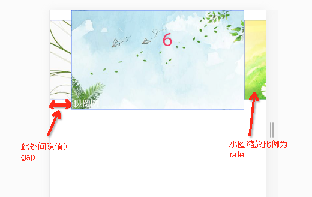
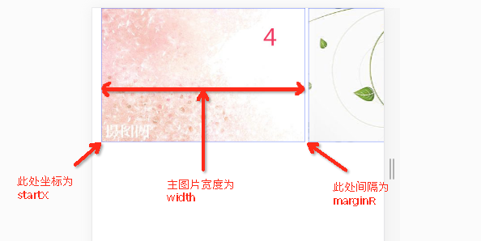

# 移动端轮播图组件

> 每个元素设置data-index属性，放置了其对应的位置下标（从0开始）

## 支持四种模式

* [base模式](http://blog.shellhong.com/effect/carousel/index-base.html)
* [scale模式](http://blog.shellhong.com/effect/carousel/index-scale.html)
* [parallel模式](http://blog.shellhong.com/effect/carousel/index-parallel.html)
* [parallel-simple模式](http://blog.shellhong.com/effect/carousel/index-parallel-simple.html)

## 使用实例

### base模式
```js
carousel.init(document.querySelector('.sky-carousel'), [
  './images/1.jpg',
  './images/2.jpg',
  './images/3.jpg',
  './images/4.jpg',
  './images/5.jpg',
  './images/6.jpg',
  './images/7.jpg'
], {
  isAutoCarousel: true, //是否自动轮播，默认为false
  animateTime: .2, //动画耗时，默认为0.2s
  autoCarouselTime: 5000, //自动轮播时间间隔，默认为5000ms,
  isSort: true //第一张图片第一次出现，依此排序
});
```
### scale模式
```js
carousel.init(document.querySelector('.sky-carousel'), [
  './images/1.jpg',
  './images/2.jpg',
  './images/3.jpg',
  './images/4.jpg',
  './images/5.jpg',
  './images/6.jpg',
  './images/7.jpg'
], {
  type: 'scale',
  gap: '10%', //图片与容器左右两边的距离，可为数字（像素值）或字符串（百分比，相对于容器宽度）
  rate: .8, //缩放比例
  isAutoCarousel: true //是否自动轮播，默认为false
});
```



### parallel模式
```js
carousel.init(document.querySelector('.sky-carousel'), [
  './images/1.jpg',
  './images/2.jpg',
  './images/3.jpg',
  './images/4.jpg',
  './images/5.jpg',
  './images/6.jpg',
  './images/7.jpg'
], {
  type: 'parallel', // Flyme 7 图片轮播复杂模式
  width: '70%', //图片宽度，可为数字（像素值）或字符串（百分比，相对于容器宽度）
  marginR: 10, //图片彼此间的距离，可为数字（像素值）或字符串（百分比，相对于容器宽度）
  animateTime: .2, //动画时间
  startX: 30, // 第一张图片的起始位置
  dragHolder: 120, // 反弹距离
  effectDistance: 20 // 能切换到下个图片的拖拽生效距离
});
```



### parallel-simple模式
```js
carousel.init(document.querySelector('.sky-carousel'), [
  './images/1.jpg',
  './images/2.jpg',
  './images/3.jpg',
  './images/4.jpg',
  './images/5.jpg',
  './images/6.jpg',
  './images/7.jpg'
], {
  type: 'parallel-simple', // Flyme 7 图片轮播复杂模式
  width: '70%', //图片宽度，可为数字（像素值）或字符串（百分比，相对于容器宽度）
  marginR: 10, //图片彼此间的距离，可为数字（像素值）或字符串（百分比，相对于容器宽度）
  isAutoCarousel: true, //是否自动轮播，默认为false
  animateTime: .2, //动画时间
  autoCarouselTime: 5000, //自动轮播时间间隔
  startX: 30, // 第一张图片的起始位置
  effectDistance: 20 // 能切换到下个图片的拖拽生效距离
});
```

##  相关的博客文章

[点击阅读](http://blog.shellhong.com/export/views/work/carousel/index.html)
