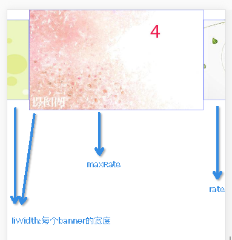
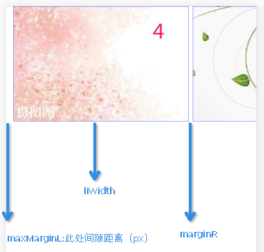
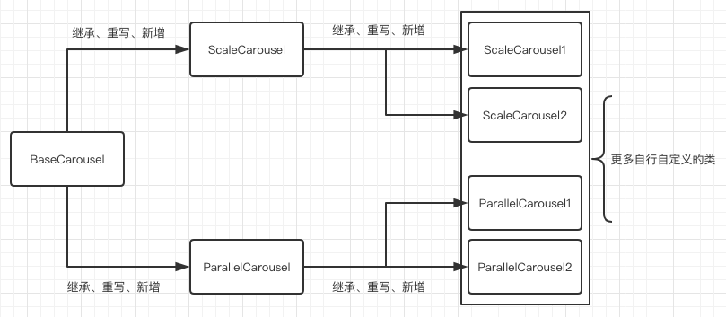

# 移动端轮播图组件

> 每个元素设置data-index属性，放置了其对应的位置下标（从0开始）

## 支持三种模式

* [base模式](http://blog.shellhong.com/effect/carousel/BaseCarousel.html)
* [scale模式](http://blog.shellhong.com/effect/carousel/ScaleCarousel.html)
* [parallel模式](http://blog.shellhong.com/effect/carousel/ParallelCarousel.html)

## 使用实例

### base模式
```js
var carouselObj = new BaseCarousel(document.querySelector('.sky-carousel'), [
  './images/1.jpg',
  './images/2.jpg',
  './images/3.jpg',
  './images/4.jpg',
  './images/5.jpg',
  './images/6.jpg',
  './images/7.jpg'
], {
  auto: true, // 是否自动轮播，默认为false
  endAnimateTime: .2, // 动画耗时，默认为0.2s
  autoStepTime: 5000, // 自动轮播时间间隔，默认为5000ms,
  isSort: true, // 第一张图片第一次出现，依此排序
  effectDistance: 30 // 移动多少px后松手，会自动滑动到下一个banner
});
carouselObj.init();
```
### scale模式
```js
var carouselObj = new ScaleCarousel(document.querySelector('.sky-carousel'), [
  './images/1.jpg',
  './images/2.jpg',
  './images/3.jpg',
  './images/4.jpg',
  './images/5.jpg',
  './images/6.jpg',
  './images/7.jpg'
], {
  rate: .8, // 缩小比例
  maxRate: 1, // 放大比例，默认为1
  liWidth: window.innerWidth * .8 // 每个banner的宽度
});
carouselObj.init();
```



### parallel模式
```js
var carouselObj = new ParallelCarousel(document.querySelector('.sky-carousel'), [
  './images/1.jpg',
  './images/2.jpg',
  './images/3.jpg',
  './images/4.jpg',
  './images/5.jpg',
  './images/6.jpg',
  './images/7.jpg'
], {
  isSort: true,
  auto: false,
  liWidth: window.innerWidth * .7,
  maxMarginL: 40, // banner间，较大的那个缝隙，出现在左边最开始位置
  marginR: 15 // banner间，较小的那个缝隙
});
carouselObj.init();
```



## 拓展

上述三个demo代表了三种图片轮播模式，其中`BaseCarousel`是另外两种模式的基础，也可以说是一切拓展模式的基础。其他类型的banner轮播图模式，都是继承于`BaseCarousel`，然后通过重写、新增自定义逻辑等方式拓展。



##  相关的博客文章

[点击阅读](http://blog.shellhong.com/export/views/work/carousel/index.html)
